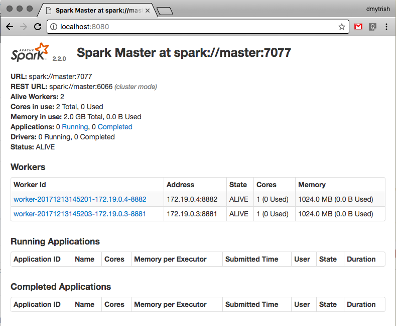

# Віртуальний кластер Spark у контейнерах Docker

Пройшовши цей посібник, ви навчитеся створювати свій власний віртуальний кластер розподіленого обчислювального середовища [Apache Spark](https://spark.apache.org/) поверх системи контейнеризації [Docker](https://docs.docker.com/) і зможете використовувати його як тестове середовище для виконання розподілених обчислень.


### Що мені знадобиться?

- базове знання командного рядка bash;
- комп'ютер із Linux, Mac OS X або (на власний ризик) Windows;
- пара гігабайт вільного місця на жорсткому диску: образи Docker можуть займати сотні мегабайт;
- три гігабайта вільної оперативної пам'яті (не жорстка вимога);


### Що таке Apache Spark?

<a href="https://spark.apache.org/">Apache Spark</a> (<a href="https://uk.wikipedia.org/wiki/Apache_Spark">вікі</a>; у просторіччі просто Spark, хоча існують багато інших проектів із цим іменем) — це розподілене обчислювальне середовище із багатим набором обчислювальних примітивів, підтримкою SQL-подібних операцій над таблично-структурованими наборами даних обмежених типів (`DataFrame`), та можливістю обробки потоків подій у реальному часі. Apache Spark динамічно масштабується (додавання/видалення вузлів на льоту) та абстрагує користувачів від конкретних вузлів кластера, а також забезпечує стійкість до відмов вузлів кластера.

У порівнянні із <a href="https://uk.wikipedia.org/wiki/Apache_Hadoop">Apache Hadoop</a>:

- Spark дає багатий набір обчислювальних примітивів (`map`, `reduce`, `filter`, `aggregate`, `sortBy`), із автоматичним аналізом та плануванням залежностей обчислення (конкретні вузли кластера абстраговані від обчислення) на відміну від Hadoop, який виконує будь-яке обчислення як набір операцій <a href="https://uk.wikipedia.org/wiki/MapReduce">map-reduce</a>;
- написаний мовою Scala, яка працює на JVM і має тісну інтеграцію із Java, але офіційні інтерфейси також доступні для мов Java, Python, R;
- працює із даними у пам'яті (структурованими у вигляді Resilient Distributed Dataset, RDD, або більш обмежених, але SQL-сумісних DataFrame), на відміну від Hadoop, проміжні результати обчислень у якому мусять писатись у файлове сховище;
- підтримує потокову обробку даних у реальному часі (Apache Streaming), на відміну від Hadoop, який орієнтований на пакетну [batch mode] обробку даних;
- є набагато простішим у розгортанні та налаштуванні кластера, зокрема підтримує самостійний режим [standalone mode], але також просто інтегрується із екосистемою Hadoop, його розподіленою файловою системою HDFS та Hadoop-кластерами;

Матеріали:

- Огляд: https://spark.apache.org/docs/2.2.0/index.html;
- Онлайн-курс від авторів: https://www.coursera.org/learn/scala-spark-big-data;


### Що таке Docker?

<a href="https://uk.wikipedia.org/wiki/Docker">Docker</a> — це досить молода, але широко відома система <a href="https://uk.wikipedia.org/wiki/%D0%92%D1%96%D1%80%D1%82%D1%83%D0%B0%D0%BB%D1%96%D0%B7%D0%B0%D1%86%D1%96%D1%8F_%D0%BD%D0%B0_%D1%80%D1%96%D0%B2%D0%BD%D1%96_%D0%BE%D0%BF%D0%B5%D1%80%D0%B0%D1%86%D1%96%D0%B9%D0%BD%D0%BE%D1%97_%D1%81%D0%B8%D1%81%D1%82%D0%B5%D0%BC%D0%B8">контейнеризації програмного забезпечення</a> поверх ядра Linux. Docker дозволяє швидко встановлювати образи практично будь-якого серверного програмного забезпечення без жодної конфігурації, швидко і відтворювано змінювати і доповнювати їх, дозволяє автоматизувати створення/запуск/моніторинг контейнерів, скриптувати їхні властивості (відкриті порти, мережі, до яких вони приєднані, квоти на ресурси) та <span data-toggle="tooltip" title="deployment">розгортання </span> серверного програмного забезпечення (із Docker ситуації типу *"а на моєму комп'ютері все працює!"* більше неможливі, образи є однаковими з точністю до байта на машині розробника і на сервері).

Docker по своїй суті є зручною обгорткою над вбудованою функціональністю ядра Linux (<a href="https://uk.wikipedia.org/wiki/Cgroups">cgroups</a> та process/network/ namespaces), а також бурхливою екосистемою готових і відтворюваних образів для запуску. Основним репозиторієм готових образів є https://hub.docker.com, але будь-хто може створити свій власний.

Якщо ви не використовуєте Linux як основну систему, не турбуйтесь: інсталятори Докера доступні для Mac/Windows і вони встановлюють віртуалізований Linux поверх вашої основної системи без жодних зусиль із вашого боку і втручання в роботу основної системи (Docker можна видалити як звичайну програму).

Докер також має вбудовані додаткові засоби для роботи із багатьма контейнерами як одним цілим: <a href="https://docs.docker.com/compose/">docker-compose</a> (який дозволяє описати фіксований набір контейнеризованих сервісів, що залежать один від одного), <a href="https://docs.docker.com/engine/swarm/">docker-swarm</a> (більш орієнтований на динамічні кластери сервісів і швидке динамічне масштабування ресурсів).

Наш кластер використовує фіксовану конфігурацію кластера: один координуючий і два робочих вузла, кожний у своєму контейнері, тому docker-compose більш ніж достатньо для наших цілей.

Матеріали:

- Інсталятори Docker: https://www.docker.com/community-edition#/download ;
- Документація по Docker: https://docs.docker.com/get-started/ ;
- Великий репозиторій готових образів: https://hub.docker.com ;
- Docker Community Edition є відкритим, опенсорсним проектом, написаним мовою Go, його код доступний на Github: https://github.com/docker/docker-ce ;


### Анатомія кластера Spark

Spark може запускатись у самостійному режимі [standalone mode], який корисний для швидкого тестування Spark-програм, але основним режимом його роботи є кластерний режим.

Кластер Spark складається із таких вузлів (які в ідеалі запущені на різних комп'ютерах, але в нашому сценарії є просто Docker-контейнерами):

- не менше одного координуючого вузла [master node]  (більше ніж один координуючий вузол — зазвичай три або п'ять — потрібен лише для забезпечення безвідмовності кластера, для наших цілей вистачить одного). Координуючий вузол приймає завдання на виконання, автоматично створює план їх виконання та список робочих вузлів, які виконуватимуть завдання (залежно від конфігурації, доступності та навантаження робочих вузлів), моніторить їх доступність та завантаженість, збирає результати.

- нуль або більше робочих вузлів [worker node], які виконують частини завдання та мають доступ до вхідних даних (наприклад, через HDFS, через спільну файлову систему, через SQL-сервер, тощо).


## Встановлення середовища
[](#install_environment)

### 1. Встановіть і запустіть Docker CE (Community Edition)

Приклад, Docker for Mac (лінукс-версія не має графічного інтерфейсу):


Перевірте, що Docker доступний із командного рядка (виконання команди `docker version` повинно давати приблизно такий вивід):

```
$ docker version
Client:
 Version:      17.11.0-ce
 API version:  1.34
 Go version:   go1.8.4
 Git commit:   1caf76c
 Built:        Mon Nov 20 18:30:18 2017
 OS/Arch:      darwin/amd64

Server:
 Version:      17.11.0-ce
 API version:  1.34 (minimum version 1.12)
 Go version:   go1.8.5
 Git commit:   1caf76c
 Built:        Mon Nov 20 18:39:28 2017
 OS/Arch:      linux/amd64
 Experimental: true
```

### 2. Стягніть образ [gettyimages/spark](https://hub.docker.com/r/gettyimages/spark)

Стягніть [pull] цей Docker-образ із Докерхаба: https://hub.docker.com/r/gettyimages/spark/ (Dockerfile, скрипт для самостійного створення цього образу <a href="https://github.com/gettyimages/docker-spark/blob/master/Dockerfile">доступний на Github</a>):

```
$ docker pull gettyimages/docker-spark
```

Після цього у списку локально доступних образів має з'явитись приблизно таке:

```
$ docker images
REPOSITORY          TAG                 IMAGE ID            CREATED             SIZE
gettyimages/spark   latest              498e797633f6        4 months ago        751MB
```

### 3. Склонуйте репозиторій із описом кластера

Склонуйте https://github.com/EarlGray/docker-spark через git або завантажте/розпакуйте zip-архів цього репозиторія: 


```
# через git:
$ git clone https://github.com/EarlGray/docker-spark
```

Перейдіть у розпакований/склонований репозиторій у командному рядку:
```
$ cd docker-spark/
```

### 4. Підніміть кластер

Віртуальний кластер піднімається однією командою, яка вичитує конфігурацію із файла [docker-compose.yml](docker-compose.yml) і створює/запускає контейнери для всіх вузлів кластера:

```
$ docker-compose up
Creating network "dockerspark_default" with the default driver                                 
Creating dockerspark_master_1 ...                                                                          
Creating dockerspark_master_1 ... done               
Creating dockerspark_worker2_1 ...                                                                      
Creating dockerspark_worker1_1 ...                                                    
Creating dockerspark_worker1_1                                                          
Creating dockerspark_worker1_1 ... done                                                 
Attaching to dockerspark_master_1, dockerspark_worker2_1, dockerspark_worker1_1        
# ... далі іде інтерактивний комбінований вивід із усіх трьох контейнерів ...
```

Команда `docker ps` (список запущених контейнерів) у новому терміналі повинна виводити приблизно таке:

```
$ docker ps
CONTAINER ID        IMAGE               COMMAND                  CREATED             STATUS              PORTS                                                                                                           NAMES
9de48c978355        gettyimages/spark   "bin/spark-class org…"   2 minutes ago       Up 2 minutes        7012-7016/tcp, 8882/tcp, 0.0.0.0:8082->8082/tcp                                                                 dockerspark_worker2_1
953547f5cfee        gettyimages/spark   "bin/spark-class org…"   2 minutes ago       Up 2 minutes        7012-7016/tcp, 8881/tcp, 0.0.0.0:8081->8081/tcp                                                                 dockerspark_worker1_1
1f32a49d7e53        gettyimages/spark   "bin/spark-class org…"   2 minutes ago       Up 2 minutes        0.0.0.0:4040->4040/tcp, 0.0.0.0:6066->6066/tcp, 0.0.0.0:7077->7077/tcp, 0.0.0.0:8080->8080/tcp, 7001-7006/tcp   dockerspark_master_1
```

Як бачимо, docker-compose створив три контейнери на базі образу `gettyimages/spark`, названі `dockerspark_master_1`, `dockerspark_worker1_1` та `dockerspark_worker2_1`.

Веб-інтерфейс координатора тепер доступний як http://localhost:8080:




### 5. Запуск тестового завдання для кластера

У образі `gettyimages/spark` присутній стандартний набір прикладів Spark-програм. Використаємо <a href="https://github.com/apache/spark/blob/master/examples/src/main/scala/org/apache/spark/examples/SparkPi.scala">приклад SparkPi</a> для перевірки фунціонування кластера та як приклад запуску Spark-завдання.

Щоб запустити завдання на кластері, можна запустити новий командний рядок (`/bin/bash`) на координаторі (контейнер якого називається `dockerspark_master_1`, але `docker-compose` знає його під іменем `master`):

```
$ docker-compose exec master /bin/bash
root@master:/usr/spark-2.2.0# 
```

&hellip;і з цього командного рядка виконати запуск нового Spark-завдання:

```
# bin/run-example SparkPi 10
```

Оновіть веб-інтерфейс координатора, там у списку **Running Applications** має з'явитись нове завдання, яке через деякий час перейде в розділ **Completed** ("завершені"):


В виводі `bin/run-example` має бути присутній рядок:

```
Pi is roughly 3.1408711408711407
```


### 6. Знищення кластера і його контейнерів

Щоб погасити кластер і знищити контейнери, виконайте у новому терміналі у директорії файла docker-compose.yml (або просто натисніть Ctrl-C у терміналі із запущеним `docker-compose up`):

```
$ docker-compose down
```


## Про docker-compose.yml
[](#docker-compose)

Формат конфігураційних файлів docker-compose повністю описано тут: https://docs.docker.com/compose/compose-file/.

docker-compose.yml для нашого кластера виглядає так:

В розділі `services` ми описуємо три контейнера: `master`, `worker1`, `worker2`. Для кожного із них ми опсиуєм такі властивості:

- `image`: який образ брати за основу для цього контейнера;
- `command`: перша команда, що виконується із образа у цьому контейнері;
- `environment`: найважливішою змінною тут є `MASTER`, яка вказує, де знаходиться координуючий сервер кластера;
- `ports`: список tcp-портів, які стають видимими на основній системі (як localhost) і перенаправлюють [forward] з'єднання в контейнер;
- `volumes`: список директорій, спільних для вашої основної системи і контейнера. Наприклад, `./data:/tmp/data` означає, що директорія `./data` на вашій основній системі (шлях відносно до директорії, що містить docker-compose.yml) видима цьому контейнеру як `/tmp/data` і може використовуватись для передачі файлів у контейнер і назад. Також такі спільні директорії можна використовувати як спільне для контейнерів файлове сховище.


## Програмування під Spark
[](#spark-example)

TODO

<hr>
<div style="text-align: right;">Дмитро Сіренко, грудень 2017</div>
